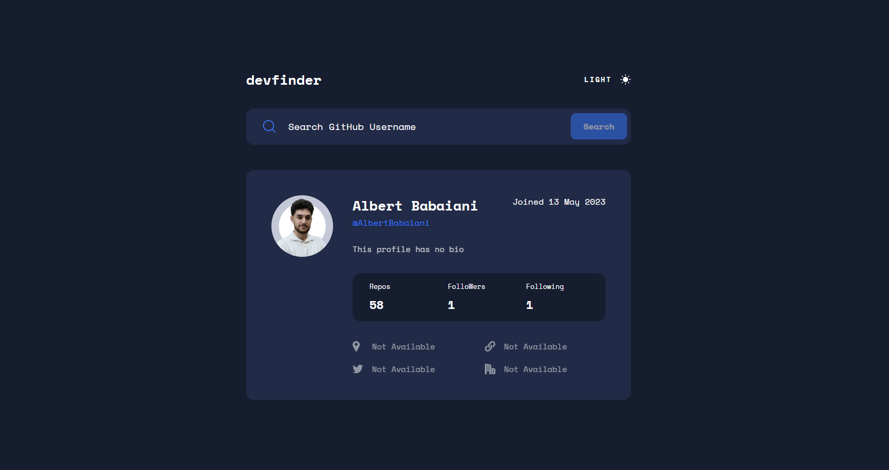
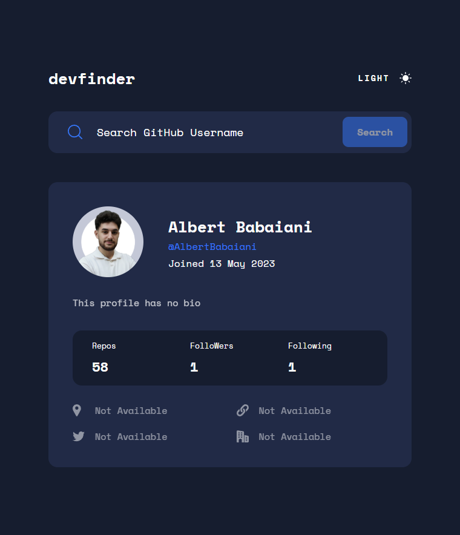
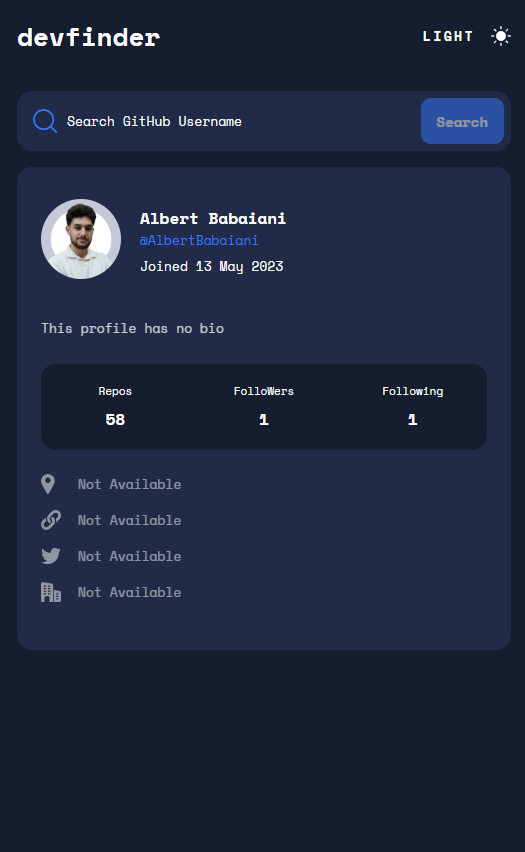

# 🔍 DevFinder | GitHub User Profile Explorer

  
  
  
  

   
   

  
  
  

   

---

## 🚀 About The Project

**DevFinder** is a fully responsive, sleek web application that interacts directly with the GitHub REST API to fetch and display detailed user profile data instantly. Built with a mobile-first philosophy, it allows users to search for any developer on GitHub and view crucial statistics, bio information, and social links in a clean, highly readable interface.

Beyond standard API fetching, this application prioritizes a premium user experience. It features a fully persistent Dark/Light mode toggle, perfectly smooth layout animations, comprehensive error handling with custom empty-state UI, and intelligent data formatting to ensure all external links and missing data are handled gracefully.

### Key Technical Concepts

This project is a showcase of modern front-end web development, utilizing the absolute latest features of the Angular framework and architectural best practices:

- **Modern Angular Reactivity:** Completely drops traditional RxJS behavior subjects for UI state in favor of **Angular Signals**. Uses `signal`, `computed`, and `effect` for granular, boilerplate-free state management and instant DOM updates without `ChangeDetectorRef`.
- **State-Driven UI Animations:** Utilizes `@angular/animations` to orchestrate smooth UI choreographies. Features a custom `@expandFade` trigger that smoothly expands the profile card's height and fades it in, creating a satisfying "push" effect on the search bar.
- **Persistent Theme Management:** A dedicated `ThemeChanger` service uses Angular's `effect()` primitive to automatically sync a user's Dark/Light mode preference with the `document.body` class and `localStorage` for a seamless experience across sessions.
- **Robust Error Handling:** Avoids jarring alert boxes by dynamically rendering a beautifully styled "Empty State" card when the GitHub API returns a 404, using the new Angular `@if / @else if` control flow.
- **Advanced SCSS Architecture:** Employs CSS Custom Properties (variables) bound to theme classes to instantly globally recolor the application interface. Also utilizes modern CSS properties like `aspect-ratio` to prevent layout shifts during image loading.

---

## 📱 Visual Showcase

> **Note:** Because this app features state-driven expand/fade transitions, a live demo is highly recommended to experience the UI mechanics!

 
  <h3>Desktop Experience</h3>
  

 

  

    <h3>Tablet View</h3>
    
  

  

    <h3>Phone View</h3>
    
  

---

## 🛠️ Built With

- **[Angular 20](https://angular.dev/)** - Framework utilizing Standalone Components, Signals, `input.required()`, and the new Control Flow syntax.
- **[TypeScript](https://www.typescriptlang.org/)** - For strict typing of the `GitHubUser` JSON data models and application logic.
- **[SCSS / SASS](https://sass-lang.com/)** - Utilizing deeply nested syntax and CSS variables for a maintainable, two-tier design system.
- **[Angular Animations](https://angular.dev/guide/animations)** - For complex, state-driven UI transitions (height calculations, opacity fading, and staggering).
- **[GitHub REST API](https://docs.github.com/en/rest)** - The backend data source for real-time developer profiles.
